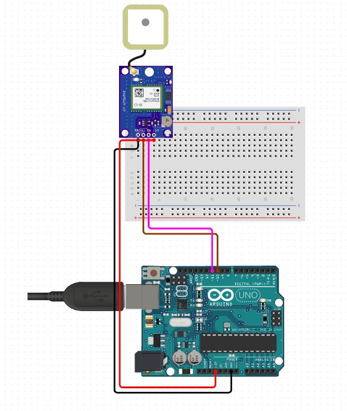

# IoT device (Ship Tracking)

This repository contains an arduino code to get the location of the device and send it to the computer by serial communication. It also contains a python code to serialize this arduino data and send it to our backend system

## Tech Stack

**Physical Materials:** 
- GPS module GY-GPS6MV1 
- Arduino Uno R3 
- PC to run the script

**Language:** 
- Ino code: Arduino code that is compiled to C++
- Python: To run the script

## Have the materials and want to test the code?

1. Download the [TinyGPS library](https://github.com/mikalhart/TinyGPS).
2. Assemble the connections as it is in the circuit.

3. Upload the code to the arduino.